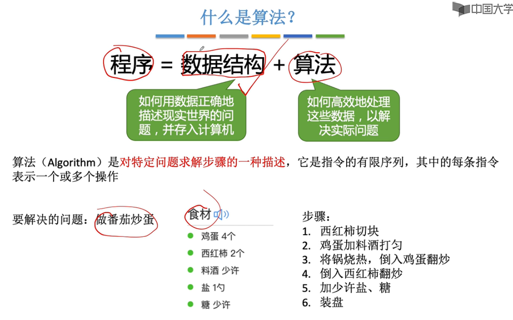
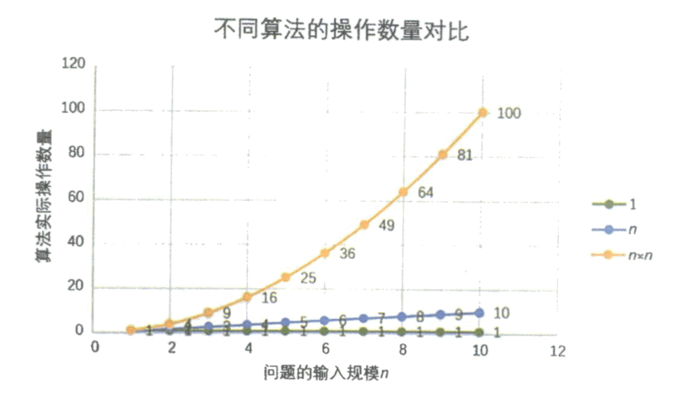

# 02 算法

## 2.1 两种算法的对比

　　求 1+ 2+3····+100 的结果

　　**第一种：**

```cpp
#include<bits/stdc++.h>
using namespace std;
int main()
{
    int sum=0;
    for(int i=1;i<=100;i++)
    {
        sum+=i;
    }
    cout<<sum<<endl;
    return 0;
}
```

　　**第二种：**

```cpp
#include<bits/stdc++.h>
using namespace std;
int main()
{
    int sum=0;
    sum=(1+100)*100/2;
    cout<<sum<<endl;
    return 0;
}
```

　　第一种方法采用累加的算法，一共循环了 100 次。

　　第二种方法采用等差数列，一共计算了 1 次。

　　节省了 99 次的运算的时间。

## 2.2 算法定义

　　**算法**是解决特定问题求解步骤的描述，在计算机中表现为指令的有限序列，并且每条指令表示一个或多个操作。

　　通过例子可以发现，对于给定的问题，可以有多种算法来解决。

　　为了解决某个或某类问题，需要把指令表示成—定的操作序列操作序列包括组
操作，每个操作都完成特定的功能，这就是算法。

　　操作可以理解为动作、方法等概念。

　　​

　　图中的步骤就是算法，食材是数据结构。

## 2.3 算法的特性

　　**算法的特性**

1. **有穷性**（有限时间结束）
2. **确定性**（确定的输入有确定的输出）
3. **可行性**（有限次数结束）
4. **输入**（零个 or 多个输入）
5. **输出**（一个 or 多个输出）

## 2.4 算法设计的要求

　　**“好”算法的特质**

1. 正确性：算法的正确性是指算法至少应该具有输入、输出和加工处理无歧义性，能正确反映问题的需求，能够得到问题的正确答案。
2. 可读性：算法设计的另一目的是为了便于阅读、理解和交流。
3. 健壮性：当输入数据不合法时，算法也能做出相关处理，而不是产生异常或不符合实际的结果。
4. 高效率与低存储量需求：尽量满足时间效率高和存储量低的需求。

## 2.5 算法效率度量的方法

　　**事后统计方法**：主要是通过设计好的测试程序和数据，利用计算机计时器
对不同算法编制的程序的运行时间进行比较，从而确定算法效率的高低。

　　**存在的问题**：

1. 事后才能通过计时发现算法的优劣。
2. 和机器性能有关，如：超级计算机 VS 单片机。
3. 和编程语言有关，越高级的语言执行效率月底。
4. 有些算法时不能事后再统计的，如：导弹控制算法。

　　**事前分析估算法**：在计算机程序编制前，依据统计方法对算法进行估算。考虑时间开销 $T(n)$ 与**问题规模** $n$ 的关系。

　　由于事后统计方法的缺陷，通常采用事前分析估算法来度量算法效率。

　　高级程序语言编写的程序在计算机上运行时的**所消耗的时间**取决于**下列因素**：

1. 算法所采用的策略、方法（算法好坏的根本）
2. 编辑产生的代码质量（软件支持）
3. 问题的输入规模（输入量的多少）
4. 机器执行指令的速度（硬件性能）

　　‍

　　注释为语句频度。

```cpp
#include<bits/stdc++.h>
using namespace std;
int main()
{
    int sum=0;//1次
    for(int i=1;i<=100;i++)//100次
    {
        sum+=i;
    }
    cout<<sum<<endl;//1次
    return 0;
}

```

　　 $T(n)=1+100+1$

　　100 是当前问题规模的 $n$。

　　 $T(n)=n+2$

　　**思考**：

　　如果有上万行代码，需要一行一行数出问题规模吗？

　　‍

　　在分析程序的运行时间时，最重要的是把程序看成时独立于程序设计语言的算法或一系列步骤。

　　重要的是把基础操作的数量与输入规模关联起来，即操作的数量必须表示成输入规模的函数。

　　

　　随着 $n$ 值的越来越大，它们在时间效率上的差异也就越来越大。

## 2.6 算法时间复杂度

　　在进行算法分析时，语句总的执行次数 $T(n)$ 是关于问题规模 $n$ 的函数，进而分析 $T(n)$ 随 $n$ 的变化情况并确定 $T(n)$ 的数量级。算法的时间复杂度，也就是算法的时间量度，记作 $T(n)=O(f(n))$。它表示随问题规模的增大，算法执行时间的增长率和 $f(n)$ 的增长率相同，称作算法的渐近时间复杂度，简称为时间复杂度其中 $f(n)$ 是问题规模 $n$ 的某个函数。

　　这样用大写 $O()$ 来体现算法时间复杂的记法，我们称之为**大 O 表示法**。

　　‍

　　不同的时间复杂度：

　　$O(1)$：常数阶

　　$O(n)$：线性阶

　　$O(logn)$：对数阶

　　$O(n^2)$：平方阶

　　$O(nlogn)$：$nlogn$ 阶

　　$O(n^3)$：立方阶

　　$O(2^n)$：指数阶

　　​

1. 只考虑阶段高的部分
2. 忽略常量
3. 加法规则
4. 乘法规则
5. 考虑最坏和平均时间复杂度

　　​

　　​

## 2.7 算法空间复杂度

> 与时间复杂度计算规则相同
>
> 考虑空间与问题规模的关系
>

　　算法所需存储空间的多少也是衡量其新跟那个的一个重要方面，即算法空间复杂度。

　　如实现同样功能的软件，一个需要 1G，一个需要 1T。

　　在写代码时，可以使用空间来换取时间。

　　**思考：**

　　在一个由自然数 1-1000 中某些数字所组成的数组中，每个数字可能出现零次或者多次，并且数组是一个无序的。设计一个算法，找出出现次数最多的数字。

　　朴素算法：先排序，再对有序的序列遍历，维护相同数字出现次数的最大值。（排序的时间复杂度 + 遍历的复杂度）

　　空间换时间算法：定义 index 数组，对无序数组进行遍历，index 的下标对应无序数组中的数字，对应下标存储的数，对应下标出现的次数，维护最大次数。（哈希思想，两次次遍历的复杂度）

## 2.8 总结与思考

　　‍
