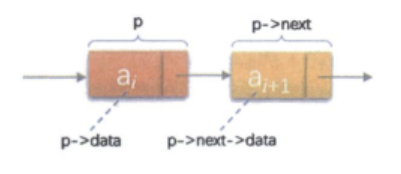
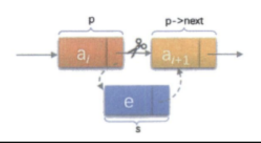
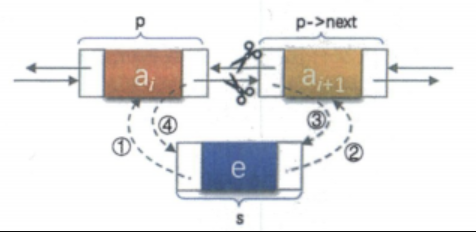

# 第三章：线性表

## 3.1 线性表的定义

1. 规范定义：线性表（List）表示零个或多个数据元素的有限序列。
2. 定义通俗理解
    - 组成成员：有限个数的元素，可以是0个，可以是多个
    - 组成结构：有一定顺序的队列

&emsp;&emsp;例如，下图可形象地表示为线性表


&emsp;&emsp;星座就是一个线性结构，有以下特性：

- 除了头部和尾部，其他成员左右，**只且只有一个成员紧邻**。在线性表中，位于当前元素左边的称为直接前驱元素，同理，右边的称为直接后驱元素。
- 元素的个数就是线性表的长度，星座是12个，所以星座线性表的长度是12。当一个成员都没有的时候，线性表的长度为0，称为**空表**。

## 3.2 线性表的抽象数据类型

1. 在复杂的线性表中，组成线性表的元素有多个组成部分，这些部分叫做数据项


&emsp;&emsp;学号是有序的序列，代表不同的学生，姓名和性别这些，就是组成学生的特征属性，也就是数据项。

2. 线性表的抽象数据类型

- 线性表的数据：线性表的数据对象集合为$\{ a_1, a_2, \cdots, a_n \}$，每个元素的类型均为 DataType。其中，除第一个元素$a_1$外，每一个元素有且只有一个直接前驱元素，除了最后一个元素$a_n$外，每一个元素有且只有一个直接后继元素。数据元素之间的关系是一对一的关系。
- 相关操作：
  - `InitList(*L)`：初始化操作，建立一个空的线性表 L
  - `ListEmpty(L)`：若线性表为空，返回`true`，否则返回`false`
  - `ClearList(*L)`：将线性表清空
  - `GetElem(L, i, *e)`：将线性表 L 中的第 i 个位置元素值返回给 e
  - `LocateElem(L, e)`：在线性表 L 中查找与给定值 e 相等的元素，如果查找成功，返回该元素在表中序号表示成功，否则，返回 0 表示失败
  - `ListInsert(*L, i, e)`：在线性表 L 中的第 i 个位置插入新元素 e
  - `ListDelete(*L, i, *e)`：删除线性表 L 中第 i 个位置元素，并用 e 返回其值
  - `ListLength(L)`：返回线性表 L 的元素个数

- 基本用法

```c
/*将所有的在线性表Lb中但不在La中的数据元素插入到La中*/
void unionL(SqList *La,SqList Lb)
{
	int La_len,Lb_len,i;
	ElemType e;                        /*声明与La和Lb相同的数据元素e*/
	La_len=ListLength(*La);            /*求线性表的长度 */
	Lb_len=ListLength(Lb);
	for (i=1;i<=Lb_len;i++)
	{
		GetElem(Lb,i,&e);              /*取Lb中第i个数据元素赋给e*/
		if (!LocateElem(*La,e))        /*La中不存在和e相同数据元素*/
			ListInsert(La,++La_len,e); /*插入*/
	}
}
```

**说明：**

- 当传递一个参数给函数时，这个参数会不会在函数内被改动决定了使用什么参数形式。
- 如果需要被改动，则需要传递指向这个参数的指针
- 如果不用被改动，可以直接传递这个参数


## 3.3 线性表的物理存储方式

&emsp;&emsp;线性表有两种存储结构，分别是顺序存储结构、链式存储结构。

### 3.3.1 顺序存储结构

&emsp;&emsp;线性表的顺序存储结构，指的是用一段地址连续的存储单元依次存储线性表的数据元素。

&emsp;&emsp;用一维的数组来实现顺序存储结构，即把第一个数据元素存储到下标 0 的位置，接着把其他元素存在相邻的位置，这样每个位置的元素都有对应的下标，从而能快速地查询。

```c
#define MAXSIZE 20          /* 存储空间初始分配量 */
typedef int ElemType;       /* ElemType类型根据实际情况而定，这里为int */
typedef struct
{
	ElemType data[MAXSIZE]; /* 数组，存储数据元素 */
	int length;             /* 线性表当前长度 */
}SqList;
```

&emsp;&emsp;从上述示例中，可以发现顺序存储结构需要三个属性：

- 存储空间的起始位置：数据`data`，它的存储位置就是存储空间的存储位置
- 线性表的最大存储容量：数组长度`MAXSIZE`
- 线性表的当前长度：`length`

&emsp;&emsp;数组的长度相当于提前预定好的空间，元素长度为线性表的实际长度，即入驻了多少个元素。线性表的长度为元素个数，是要小于等于数组长度。

#### 3.3.1.1 地址

&emsp;&emsp;**地址**：因为是以一维数组来做空间，数组都是带有下标的，所以每个存储元素都有自己的编号，这个编号就叫做地址。当知道一个元素的地址，就可以计算其他元素的地址。


&emsp;&emsp;其实，内存中的地址，就和图书馆或电影院里的座位一样，都是有编号的，存储器中的每个存储单元都有自己的编号，这个编号成为地址。假设占用的是$c$个存储单元，那么线性表中的第$i+1$个数据元素的存储位置和第$i$个数据元素的存储位置满足下列关系（LOC表示获得存储位置的函数）。
$$
\text{LOC}(a_{i+1}) = \text{LOC}(a_i) + c
$$
&emsp;&emsp;所以对于第$i$个数据元素$a_i$的存储位置可以由$a_1$推算得出：
$$
\text{LOC}(a_i) = \text{LOC}(a_1) + (i - 1) c
$$

&emsp;&emsp;通过上述公式，可以随时算出线性表中任意位置的地址，不管它是第一个还是最后一个，都是相同的时间。对每个线性表位置的存入或者取出数据，对于计算机来说都是相等的时间，也就是一个常数，存取时间性能为$O(1)$，称具有这一特点的存储结构为**随机存储结构**。

#### 3.3.1.2 元素的查找

```c
#define OK 1
#define ERROR 0
/* Status是函数的类型,其值是函数结果状态代码，如OK等 */
typedef int Status;         

/* 初始条件：顺序线性表L已存在，1≤i≤ListLength(L) */
/* 操作结果：用e返回L中第i个数据元素的值，注意i是指位置，第1个位置的数组是从0开始 */
Status GetElem(SqList L,int i,ElemType *e)
{
	if(L.length==0 || i<1 || i>L.length)
		return ERROR;
	*e=L.data[i-1];

	return OK;
}
```

#### 3.3.1.3 元素的插入操作

插入算法的思路：
1. 如果插入位置不合理，抛出异常；
2. 如果线性表长度大于等于数组长度，则抛出异常或动态增加容量；
3. 从最后一个元素开始向前遍历到第 $i$ 个位置，分别将它们都向后移动一个位置；
4. 将要插入元素填入位置 $i$ 处；
5. 表长加1。

```c

/* 初始条件：顺序线性表L已存在,1≤i≤ListLength(L)， */
/* 操作结果：在L中第i个位置之前插入新的数据元素e，L的长度加1 */
Status ListInsert(SqList *L,int i,ElemType e)
{ 
	int k;
	if (L->length==MAXSIZE)  			/* 顺序线性表已经满 */
		return ERROR;
	if (i<1 || i>L->length+1)			/* 当i比第一位置小或者比最后一位置后一位置还要大时 */
		return ERROR;				

	if (i<=L->length)        			/* 若插入数据位置不在表尾 */
	{
		for(k=L->length-1;k>=i-1;k--)  	/* 将要插入位置后的元素向后移一位 */
			L->data[k+1]=L->data[k];
	}
	L->data[i-1]=e;          			/* 将新元素插入 */
	L->length++;

	return OK;
}
```

#### 3.3.1.4 元素的删除操作

删除算法的思路：
1. 如果删除位置不合理，抛出异常；
2. 取出删除元素；
3. 从删除元素位置开始遍历到最后一个元素位置，分别将它们都向前移动一个位置；
4. 表长减1

```c

/* 初始条件：顺序线性表L已存在，1≤i≤ListLength(L) */
/* 操作结果：删除L的第i个数据元素，并用e返回其值，L的长度减1 */
Status ListDelete(SqList *L,int i,ElemType *e) 
{ 
	int k;
	if (L->length==0)               /* 线性表为空 */
		return ERROR;
	if (i<1 || i>L->length)         /* 删除位置不正确 */
		return ERROR;
	*e=L->data[i-1];
	if (i<L->length)                /* 如果删除不是最后位置 */
	{
		for(k=i;k<L->length;k++)	/* 将删除位置后继元素前移 */
			L->data[k-1]=L->data[k];
	}
	L->length--;
	return OK;
}
```

#### 3.3.1.5 顺序存储结构的优缺点

**优点：**

- 无需为表示表中元素之间的逻辑关系而增加额外的存储空间
- 可以快速地存取表中任一位置的元素

**缺点：**

- 插入和删除操作需要移动大量元素
- 当线性表长度变化较大时，难以确定存储空间的容量
- 造成存储空间的“碎片”


### 3.3.2 链式存储结构


&emsp;&emsp;顺序结构的缺点在于插入和删除，需要移动大量的元素，耗费时间。为了解决这个整体移动的情况，用一组任意的存储单元来存储数据元素，这些存储位置可以是连续的，也可以是不连续的，但是要保证元素之间的直接前驱元素和直接后继元素能够有关联且唯一，即存储对应的地址。

#### 3.3.2.1 组成部分

- 数据域：存储数据元素信息的域叫做数据域
- 指针域：存储直接后继元素位置的域叫做指针域
- 结点：数据域+指针域组合

&emsp;&emsp;$n$个节点（$a_i$的存储映像）链结成一个链表，即为线性表 $(a_1, a_2, \cdots, a_n)$ 的链式存储结构，该链表的每个结点中包含一个指针域，称为**单链表**，通过每个结点的指针域将线性表的数据元素按其逻辑次序链接在一起。

&emsp;&emsp;把链表中的第一个节点的存储位置称为**头指针**，规定线性链表的最后一个结点指针为“空”（通常用`NULL`或`^`符号表示）。有时，为了更加方便对链表进行操作，会在单链表的第一个结点前附设一个结点，称为**头节点**。头结点的数据域可以不存储任何信息，


#### 3.3.2.2 注意事项

头指针与头结点的比较：
1. 头指针
  - 头指针是指链表指向第一个结点的指针，若链表有头结点，则是指向头结点的指针
  - 头指针具有标志作用，所以常用头指针作为链表的名字
  - 无论链表是否为空，头指针均不为空。头指针是链表的必要元素

2. 头结点
  - 头结点是为了操作的统一和方便而设立的，放在第一元素的结点之前，其数据域一般无意义（也可存放链表的长度）
  - 有了头结点，对在第一元素结点前插入结点和删除第一结点，其操作与其他结点的操作就统一了
  - 头结点不一定是链表必需要素

#### 3.3.2.3 链式结构代码

```c
/* 线性表的单链表存储结构 */
typedef struct Node
{
	ElemType data;
	struct Node *next;
}Node;
typedef struct Node *LinkList; /* 定义LinkList */

```

&emsp;&emsp;以上的结构定义表示，**结点由存放数据元素的数据域和存放后继结点地址的指针域组成。**假设 $p$ 是指向线性表第 $i$ 个元素的指针，则该结点 $a_i$ 的数据域可以用`p->data`表示，`p->data`的值是一个数据元素，结点 $a_i$的指针域可以用`p->next`表示，`p->next`的值是一个指针。




## 3.4 各种各样的链表

### 3.4.1 单链表

#### 3.4.1.1 单链表的读取

&emsp;&emsp;在单链表中，如果要找第 $i$ 个元素，需要从头开始找，对于单链表实现获取第 $i$ 个元素的数据的操作`GetElem`，在算法上要麻烦一些。

**算法思路：**  
1. 声明一个指针`p`指向链表第一个结点，初始化`j`从1开始；
2. 当 $j<i$ 时，遍历链表，让`p`的指针向后移动，不断指向下一个结点，`j`累加1；
3. 若到链表末尾`p`为空，则说明第`i`个结点不存在；
4. 否则查找成功，返回结点`p`的数据。

```c
/* 初始条件：链式线性表L已存在，1≤i≤ListLength(L) */
/* 操作结果：用e返回L中第i个数据元素的值 */
Status GetElem(LinkList L,int i,ElemType *e)
{
	int j;
	LinkList p;		/* 声明一结点p */
	p = L->next;		/* 让p指向链表L的第一个结点 */
	j = 1;		/*  j为计数器 */
	while (p && j<i)  /* p不为空或者计数器j还没有等于i时，循环继续 */
	{   
		p = p->next;  /* 让p指向下一个结点 */
		++j;
	}
	if ( !p || j>i ) 
		return ERROR;  /*  第i个元素不存在 */
	*e = p->data;   /*  取第i个元素的数据 */
	return OK;
}
```

#### 3.4.1.2 单链表的插入

```c
s->next = p->next;    /* 将p的后继结点赋值给s的后继  */
p->next = s;          /* 将s赋值给p的后继 */
```

&emsp;&emsp;上述代码表示让`p`的后继结点改成`s`的后继结点，再把结点`s`变成`p`的后继结点，如下图所示：




**算法思路：**  
1. 声明一指针`p`指向链表头结点，初始化`j`从1开始；
2. 当 $j<i$ 时，遍历链表，让`p`的指针向后移动，不断指向下一个结点，`j`累加1；
3. 若到链表末尾`p`为空，则说明第`i`个结点不存在；
4. 否则查找成功，在系统中生成一个空结点`s`；
5. 将数据元素`e`赋值给`s->data`；
6. 单链表的插入标准语句`s->next=p->next; p->next=s`；
7. 返回成功。

**算法代码：**

```c
/* 初始条件：链式线性表L已存在,1≤i≤ListLength(L)， */
/* 操作结果：在L中第i个位置之前插入新的数据元素e，L的长度加1 */
Status ListInsert(LinkList *L,int i,ElemType e)
{ 
	int j;
	LinkList p,s;
	p = *L;   
	j = 1;
	while (p && j < i)     				/* 寻找第i个结点 */
	{
		p = p->next;
		++j;
	} 
	if (!p || j > i) 
		return ERROR;   				/* 第i个元素不存在 */

	s = (LinkList)malloc(sizeof(Node)); /* 生成新结点(C语言标准函数) */
	s->data = e;  
	s->next = p->next;    				/* 将p的后继结点赋值给s的后继 */
	p->next = s;          				/* 将s赋值给p的后继 */
	return OK;
}
```

#### 3.4.1.3 单链表的删除

&emsp;&emsp;单链表的删除操作，设存储元素 $a_i$ 的结点为`q`，要实现将结点`q`删除单链表的操作，就是将它的前继结点的指针绕过，指向它的后继结点即可。


**算法思路：**  
1. 声明一指针`p`指向链表头结点，初始化`j`从1开始；
2. 当 $j<i$ 时，遍历链表，让`p`的指针向后移动，不断指向下一个结点，`j`累加1；
3. 若到链表末尾`p`为空，则说明第`i`个结点不存在；
4. 否则查找成功，将要删除的结点`p->next`赋值给`q`；
5. 单链表的删除标准语句`p->next=q->next`；
6. 将`q`结点中的数据赋值给`e`，作为返回
7. 释放`q`结点；
8. 返回成功。

**算法代码：**

```c
/* 初始条件：链式线性表L已存在，1≤i≤ListLength(L) */
/* 操作结果：删除L的第i个数据元素，并用e返回其值，L的长度减1 */
Status ListDelete(LinkList *L,int i,ElemType *e) 
{ 
	int j;
	LinkList p,q;
	p = *L;
	j = 1;
	while (p->next && j < i)	/* 遍历寻找第i个元素 */
	{
		p = p->next;
		++j;
	}
	if (!(p->next) || j > i) 
		return ERROR;           /* 第i个元素不存在 */
	q = p->next;
	p->next = q->next;			/* 将q的后继赋值给p的后继 */
	*e = q->data;               /* 将q结点中的数据给e */
	free(q);                    /* 让系统回收此结点，释放内存 */
	return OK;
}
```

#### 3.4.1.4 单链表的整表创建

**头插法的算法思路：**  
1. 声明一指针`p`和计数器变量`i`
2. 初始化一空链表`L`
3. 让`L`的头结点的指针指向`NULL`，即建立一个带头结点的单链表
4. 循环：
    - 生成一新结点赋值给`p`；
    - 随机生成一数字赋值给`p`的数据域`p->data`；
    - 将`p`插入到头结点与前一新结点之间。

**头插法的算法代码：**

```c
/*  随机产生n个元素的值，建立带表头结点的单链线性表L（头插法） */
void CreateListHead(LinkList *L, int n) 
{
	LinkList p;
	int i;
	srand(time(0));                         /* 初始化随机数种子 */
	*L = (LinkList)malloc(sizeof(Node));
	(*L)->next = NULL;                      /* 先建立一个带头结点的单链表 */
	for (i=0; i<n; i++) 
	{
		p = (LinkList)malloc(sizeof(Node)); /* 生成新结点 */
		p->data = rand()%100+1;             /* 随机生成100以内的数字 */
		p->next = (*L)->next;    
		(*L)->next = p;						/* 插入到表头 */
	}
}
```

**尾插法的算法代码：**

```c
/*  随机产生n个元素的值，建立带表头结点的单链线性表L（尾插法） */
void CreateListTail(LinkList *L, int n) 
{
	LinkList p,r;
	int i;
	srand(time(0));                     	/* 初始化随机数种子 */
	*L = (LinkList)malloc(sizeof(Node)); 	/* L为整个线性表 */
	r=*L;                                	/* r为指向尾部的结点 */
	for (i=0; i<n; i++) 
	{
		p = (Node *)malloc(sizeof(Node)); 	/* 生成新结点 */
		p->data = rand()%100+1;           	/* 随机生成100以内的数字 */
		r->next=p;                        	/* 将表尾终端结点的指针指向新结点 */
		r = p;                            	/* 将当前的新结点定义为表尾终端结点 */
	}
	r->next = NULL;                       	/* 表示当前链表结束 */
}
```

#### 3.4.1.5 单链表的整表删除

**算法思路：**  
1. 声明一指针`p`和`q`；
2. 将第一个结点赋值给`p`
3. 循环：
    - 将下一结点赋值给`q`；
    - 释放`p`
    - 将`q`赋值给`p`

**算法代码：**

```c
/* 初始条件：链式线性表L已存在。操作结果：将L重置为空表 */
Status ClearList(LinkList *L)
{ 
	LinkList p,q;
	p=(*L)->next;           /*  p指向第一个结点 */
	while(p)                /*  没到表尾 */
	{
		q=p->next;
		free(p);
		p=q;
	}
	(*L)->next=NULL;        /* 头结点指针域为空 */
	return OK;
}
```

#### 3.4.1.6 单链表与顺序存储结构的对比

|              | 顺序存储结构                                                 | 单链表                                                       |
| ------------ | ------------------------------------------------------------ | ------------------------------------------------------------ |
| 存储分配方式 | 使用一段连续存储单元依次存储线性表的数据元素                 | 采用链式存储结构，用一组任意的存储单元存放线性表的元素       |
| 时间性能     | 查找：$O(1)$ </br>插入和删除：需要平均移动表长一半的元素，时间复杂度为$O(n)$ | 查找：$O(n)$</br>插入和删除：在找出位置的指针后，时间复杂度为$O(1)$ |
| 空间性能     | 需要预分配存储空间，分大了浪费，分小了容易发生上溢           | 不需要分配存储空间，只要有就可以分配，元素个数不受限制       |


- 若线性表需要频繁查找，很少进行插入和删除操作，宜采用顺序存储结构
- 若线性表中的元素个数变化比较大或者根本不知道有多大时，最好用单链表结构


### 3.4.2 静态链表

#### 3.4.2.1 定义

&emsp;&emsp;对于没有指针的高级语言，用数组来代替指针描述单链表。数组的元素都是由两个数据域组成，`data`和`cur`，`cur`就相当于指针，叫做游标。把这种用数组描述的链表叫做**静态链表**，或者**游标实现法**

```c
#define MAXSIZE 1000 	/* 存储空间初始分配量 */

/* 线性表的静态链表存储结构 */
typedef struct 
{
	ElemType data;
	int cur;  			/* 游标(Cursor) ，为0时表示无指向 */
} Component,StaticLinkList[MAXSIZE];
```

&emsp;&emsp;对数组第一个和最后一个元素作为特殊元素处理，不存数据。把未被使用的数组元素称为备用链表。而数组第一个元素，即下标为0的元素的`cur`存放备用链表的第一个结点的下标；最后一个元素的`cur`存放第一个有数值的元素的下标，相当于单链表中的头结点作用，当整个链表为空时，则为0。


```c
/* 将一维数组space中各分量链成一个备用链表，space[0].cur为头指针，"0"表示空指针 */
Status InitList(StaticLinkList space) 
{
	int i;
	for (i=0; i<MAXSIZE-1; i++)  
		space[i].cur = i+1;
	space[MAXSIZE-1].cur = 0; 	/* 目前静态链表为空，最后一个元素的cur为0 */
	return OK;
}
```

#### 3.4.2.2 静态链表的插入

&emsp;&emsp;静态链表的插入需要注意的是，如何用静态模拟动态链表结构的存储空间的分配，需要时申请，无用时释放。可以将所有未被使用过的及已被删除的分量用游标链成一个备用的链表，每当进行插入时，便可以从备用链表上取得第一个结点作为待插入的新结点。

```c
/* 若备用空间链表非空，则返回分配的结点下标，否则返回0 */
int Malloc_SSL(StaticLinkList space) 
{ 
	int i = space[0].cur;           		/* 当前数组第一个元素的cur存的值 */
											/* 就是要返回的第一个备用空闲的下标 */
	if (space[0]. cur)         
		space[0]. cur = space[i].cur;       /* 由于要拿出一个分量来使用了， */
											/* 所以我们就得把它的下一个 */
											/* 分量用来做备用 */
	return i;
}
```

**算法代码：**

```c
Status ListInsert(StaticLinkList L, int i, ElemType e)
{
    int j, k, l;
    k = MAXSIZE - 1;                        /* 注意k首先是最后一个元素的下标 */
    if (i < 1 || i > ListLength(L) + 1)
        return ERROR;
    j = Malloc_SSL(L);                      /* 获得空闲分量的下标 */
    if (j) 
    {
        L[j].data = e;                      /* 将数据赋值给此分量的data */
        for(l = i; l <= i - 1; l++)         /* 找到第i个元素之前的位置 */
            k = L[k].cur;
        L[j].cur = L[k].cur;                /* 把第i个元素之前的cur赋值给新元素的cur */
        L[k].cur = j;                       /* 把新元素的下标赋值给第i个元素之前元素的cur */
        return OK;
    }
    return ERROR;
}
```


#### 3.4.2.3 静态链表的删除

**算法代码：**

```c
/*  删除在L中第i个数据元素   */
Status ListDelete(StaticLinkList L, int i)   
{ 
	int j, k;   
	if (i < 1 || i > ListLength(L))   
		return ERROR;   
	k = MAXSIZE - 1;   
	for (j = 1; j <= i - 1; j++)   
		k = L[k].cur;   
	j = L[k].cur;   
	L[k].cur = L[j].cur;   
	Free_SSL(L, j);   
	return OK;   
} 
```

```c
/*  将下标为k的空闲结点回收到备用链表 */
void Free_SSL(StaticLinkList space, int k) 
{  
	space[k].cur = space[0].cur;    /* 把第一个元素的cur值赋给要删除的分量cur */
	space[0].cur = k;               /* 把要删除的分量下标赋值给第一个元素的cur */
}
```

```c
/* 初始条件：静态链表L已存在。操作结果：返回L中数据元素个数 */
int ListLength(StaticLinkList L)
{
	int j=0;
	int i=L[MAXSIZE-1].cur;
	while(i)
	{
		i=L[i].cur;
		j++;
	}
	return j;
}
```

#### 3.4.2.4 静态链表的优缺点

**优点：**
&emsp;&emsp;在插入和删除操作时，只需要修改游标，不需要移动元素，从而改进了在顺序存储结构中插入和删除操作需要移动大量元素的缺点。

**缺点：**
&emsp;&emsp;没有解决连续存储分配带来的表长难以确定的问题，失去了链式存储结构随机存取的特性。

### 3.4.3 循环链表

循环链表简图如下：


- 空循环链表


- 非空循环链表


&emsp;&emsp;对于非空循环链表，不用头指针，而是用指向终端结点的尾指针来表示循环链表，方便查找开始结点和终端结点。

```c
p=rearA->next;   			    /* 保存A表的头结点，即① */
rearA->next=rearB->next->next;	/* 将本是指向B表的第一个结点（不是头结点）*/
                 				/* 赋值给reaA->next，即② */
q=rearB->next;
rearB->next=p;				   	/* 将原A表的头结点赋值给rearB->next，即③ */
free（q）;					   	/* 释放q */
```

### 3.4.4 双向链表

&emsp;&emsp;双向链表是在单链表的每个结点中，再设置一个指向其前驱结点的指针域。所以再双向链表中的结点都有两个指针域，一个指向直接后继，另一个指向直接前驱。

```c
/*线性表的双向链表存储结构*/
typedef struct DulNode
{
		ElemType data;
		struct DuLNode *prior;    	/*直接前驱指针*/
		struct DuLNode *next;		/*直接后继指针*/
} DulNode, *DuLinkList;
```

- 双向链表的循环带头结点的空链表


- 非空的循环带头结点的双向链表


**插入操作：**  
&emsp;&emsp;假设存储元素`e`的结点为`s`，要实现将结点`s`插入到结点`p`和`p->next`之间的操作示意图如下：



```c
s - >prior = p;   			/*把p赋值给s的前驱，如图中①*/
s -> next = p -> next;		/*把p->next赋值给s的后继，如图中②*/
p -> next -> prior = s;		/*把s赋值给p->next的前驱，如图中③*/
p -> next = s;				/*把s赋值给p的后继，如图中④*/

```
**删除操作：**  
&emsp;&emsp;删除结点`p`的示意图：


```c
p->prior->next=p->next;   	/*把p->next赋值给p->prior的后继，如图中①*/
p->next->prior=p->prior;	/*把p->prior赋值给p->next的前驱，如图中②*/
free（p）;					/*释放结点*/
```

## 3.5 习题

### 3.5.1 P3156 【深基15.例1】询问学号-简单

[P3156 【深基15.例1】询问学号 - 洛谷 | 计算机科学教育新生态 (luogu.com.cn)](https://www.luogu.com.cn/problem/P3156)

**题目描述**

有 $n(n \le 2 \times 10^6)$ 名同学陆陆续续进入教室。我们知道每名同学的学号（在 $1$ 到 $10^9$ 之间），按进教室的顺序给出。上课了，老师想知道第 $i$ 个进入教室的同学的学号是什么（最先进入教室的同学 $i=1$），询问次数不超过 $10^5$ 次。

**输入格式**

第一行 $2$ 个整数 $n$ 和 $m$，表示学生个数和询问次数。

第二行 $n$ 个整数，表示按顺序进入教室的学号。

第三行 $m$ 个整数，表示询问第几个进入教室的同学。

**输出格式**

输出 $m$ 个整数表示答案，用换行隔开。

**样例输入 #1**

```
10 3
1 9 2 60 8 17 11 4 5 14
1 5 9
```

**样例输出 #1**

```
1
8
5
```


### 3.5.2 P3613 【深基15.例2】寄包柜-简单

[P3613 【深基15.例2】寄包柜 - 洛谷 | 计算机科学教育新生态 (luogu.com.cn)](https://www.luogu.com.cn/problem/P3613)

**题目描述**

超市里有 $n(1\le n\le10^5)$ 个寄包柜。每个寄包柜格子数量不一，第 $i$ 个寄包柜有 $a_i(1\le a_i\le10^5)$ 个格子，不过我们并不知道各个 $a_i$ 的值。对于每个寄包柜，格子编号从 1 开始，一直到 $a_i$。现在有 $q(1 \le q\le10^5)$ 次操作：

* `1 i j k`：在第 $i$ 个柜子的第 $j$ 个格子存入物品 $k(0\le k\le 10^9)$。当 $k=0$ 时说明清空该格子。
* `2 i j`：查询第 $i$ 个柜子的第 $j$ 个格子中的物品是什么，保证查询的柜子有存过东西。

已知超市里共计不会超过 $10^7$ 个寄包格子，$a_i$ 是确定然而未知的，但是保证一定不小于该柜子存物品请求的格子编号的最大值。当然也有可能某些寄包柜中一个格子都没有。

**输入格式**

第一行 2 个整数 $n$ 和 $q$，寄包柜个数和询问次数。

接下来 $q$ 个整数，表示一次操作。

**输出格式**

对于查询操作时，输出答案，以换行隔开。

**样例输入 #1**

```
5 4
1 3 10000 118014
1 1 1 1
2 3 10000
2 1 1
```

**样例输出 #1**

```
118014
1
```


### 3.5.3 P1047 [NOIP2005 普及组] 校门外的树-简单

[P1047 [NOIP2005 普及组] 校门外的树 - 洛谷 | 计算机科学教育新生态 (luogu.com.cn)](https://www.luogu.com.cn/problem/P1047)

**题目描述**

某校大门外长度为 $l$ 的马路上有一排树，每两棵相邻的树之间的间隔都是 $1$ 米。我们可以把马路看成一个数轴，马路的一端在数轴 $0$ 的位置，另一端在 $l$ 的位置；数轴上的每个整数点，即 $0,1,2,\dots,l$，都种有一棵树。

由于马路上有一些区域要用来建地铁。这些区域用它们在数轴上的起始点和终止点表示。已知任一区域的起始点和终止点的坐标都是整数，区域之间可能有重合的部分。现在要把这些区域中的树（包括区域端点处的两棵树）移走。你的任务是计算将这些树都移走后，马路上还有多少棵树。

**输入格式**

第一行有两个整数，分别表示马路的长度 $l$ 和区域的数目 $m$。

接下来 $m$ 行，每行两个整数 $u, v$，表示一个区域的起始点和终止点的坐标。

**输出格式**

输出一行一个整数，表示将这些树都移走后，马路上剩余的树木数量。

**样例输入 #1**

```
500 3
150 300
100 200
470 471
```

**样例输出 #1**

```
298
```


### 3.5.4 P1160 队列安排-中等

[P1160 队列安排 - 洛谷 | 计算机科学教育新生态 (luogu.com.cn)](https://www.luogu.com.cn/problem/P1160)

**题目描述**

一个学校里老师要将班上 $N$ 个同学排成一列，同学被编号为 $1\sim N$，他采取如下的方法：

1. 先将 $1$ 号同学安排进队列，这时队列中只有他一个人；
2. $2-N$ 号同学依次入列，编号为 $i$ 的同学入列方式为：老师指定编号为 $i$ 的同学站在编号为 $1\sim(i-1)$ 中某位同学（即之前已经入列的同学）的左边或右边；
3. 从队列中去掉 $M(M<N)$ 个同学，其他同学位置顺序不变。

在所有同学按照上述方法队列排列完毕后，老师想知道从左到右所有同学的编号。

**输入格式**

第 $1$ 行为一个正整数 $N$，表示了有 $N$ 个同学。

第 $2\sim N$行，第 $i$ 行包含两个整数 $k,p$，其中 $k$ 为小于 $i$ 的正整数，$p$ 为 $0$ 或者 $1$。若 $p$ 为$ 0$，则表示将 $i$ 号同学插入到 $k$ 号同学的左边，$p$ 为 $1$ 则表示插入到右边。

第 $N+1$ 行为一个正整数 $M$，表示去掉的同学数目。

接下来 $M$ 行，每行一个正整数 $x$，表示将 $x$ 号同学从队列中移去，如果 $x$ 号同学已经不在队列中则忽略这一条指令。

**输出格式**

$1$ 行，包含最多 $N$ 个空格隔开的正整数，表示了队列从左到右所有同学的编号，行末换行且无空格。

**样例输入 #1**

```
4
1 0
2 1
1 0
2
3
3
```

**样例输出 #1**

```
2 4 1
```

**说明/提示**

样例解释：

将同学 $2$ 插入至同学 $1$ 左边，此时队列为：

`2 1`

将同学 $3$ 插入至同学 $2$ 右边，此时队列为：

`2 3 1`

将同学 $4$ 插入至同学 $1$ 左边，此时队列为：

`2 3 4 1`

将同学 $3$ 从队列中移出，此时队列为：

`2 4 1`

同学 $3$ 已经不在队列中，忽略最后一条指令

最终队列：

`2 4 1`

数据范围

对于 $20\%$ 的数据，有 $1\leq N\leq 10$；

对于 $40\%$ 的数据，有 $1\leq N\leq 1000$；

对于 $100\%$ 的数据，有 $1\leq N,M\leq100000$。


### 3.5.5 P1996 约瑟夫问题

[P1996 约瑟夫问题 - 洛谷 | 计算机科学教育新生态 (luogu.com.cn)](https://www.luogu.com.cn/problem/P1996)

**题目描述**

$n$ 个人围成一圈，从第一个人开始报数,数到 $m$ 的人出列，再由下一个人重新从 $1$ 开始报数，数到 $m$ 的人再出圈，依次类推，直到所有的人都出圈，请输出依次出圈人的编号。

**输入格式**

输入两个整数 $n,m$。

**输出格式**

输出一行 $n$ 个整数，按顺序输出每个出圈人的编号。

**样例输入 #1**

```
10 3
```

**样例输出 #1**

```
3 6 9 2 7 1 8 5 10 4
```

**说明/提示**

$1 \le m, n \le 100$
